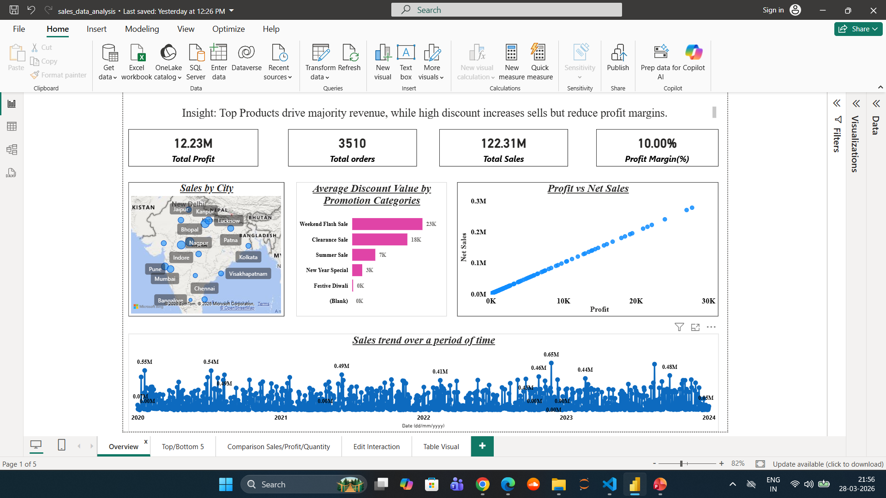
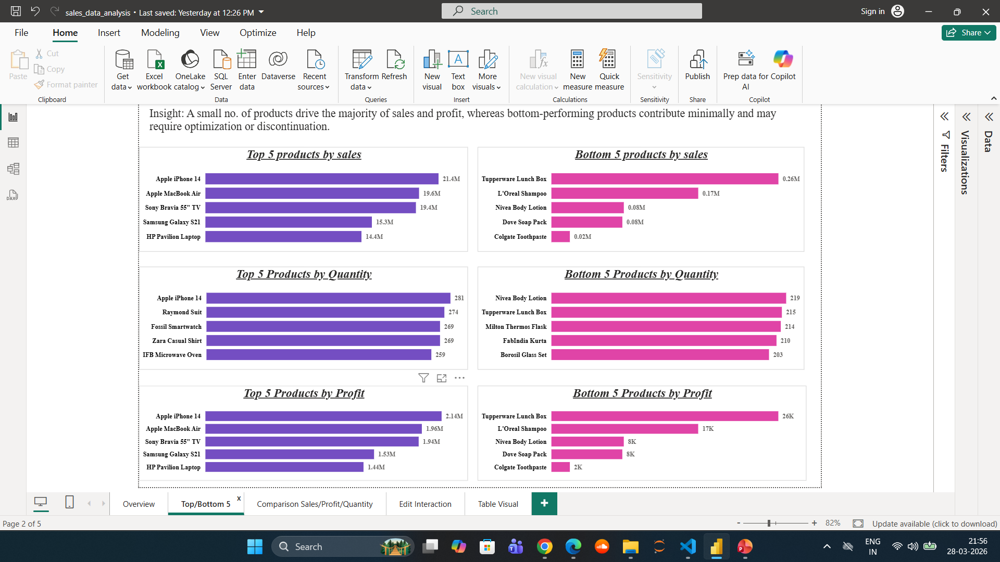

# 📊 Sales Analytics Dashboard | Power BI Project

## 🧩 Problem Statement

Organizations often lack a clear understanding of their sales performance across products, regions, and time. This makes it difficult to identify top-performing products, optimize discount strategies, and improve profitability.

This project builds an interactive Power BI dashboard to analyze sales, profit, and customer behavior, enabling better business decision-making.

---
## 📊 Dashboard Preview

### Overview

### Top / Bottom Products

## 🎯 Objectives

* Identify top and bottom performing products based on Sales, Profit, and Quantity
* Analyze sales trends over time
* Understand the relationship between sales and profit
* Evaluate the impact of discounts on performance
* Compare performance across different time periods
* Analyze sales distribution across cities

---

## 📊 Dashboard Features

* KPI Metrics: Total Sales, Total Profit, Total Orders, Profit Margin
* Top/Bottom 5 Products Analysis
* Sales Trend Over Time
* Profit vs Net Sales Scatter Plot
* Discount Analysis by Promotion Category
* City-wise Sales Map
* Interactive Filters (Date, Product, Customer, Promotion)

---

## 📈 Key Insights

* A small number of products drive the majority of revenue and profit
* Higher discounts increase sales volume but reduce profit margins
* Sales show fluctuations over time, indicating possible seasonal trends
* Certain cities contribute significantly more to total sales
* Low-performing products contribute minimally and may require optimization

---

## 💡 Business Recommendations

* Focus on high-performing products to maximize revenue
* Optimize discount strategies to balance sales growth and profitability
* Re-evaluate low-performing products
* Target high-performing regions for expansion
* Use trend analysis for better demand planning

---

## ⚠️ Important Note

**Profit was assumed as 10% of sales due to lack of cost data, used for demonstration purposes.**

---

## 🛠 Tech Stack

* Power BI
* DAX
* Power Query (ETL)
* Data Modeling (Star Schema)

---

## 📁 Project Structure

* `sales_dashboard.pbix` → Power BI dashboard
* `data/` → dataset
* `screenshots/` → dashboard previews
* `README.md` → documentation

---

## 🚀 Usage

1. Download the `.pbix` file
2. Open in Power BI Desktop
3. Use filters and visuals to explore insights

---

## 🧠 Skills Demonstrated

* Data Cleaning & Transformation
* Data Modeling
* DAX Calculations
* Dashboard Design
* Business Insight Generation

---

## 👨‍💻 Author

Aman Singh
Aspiring Data Analyst
